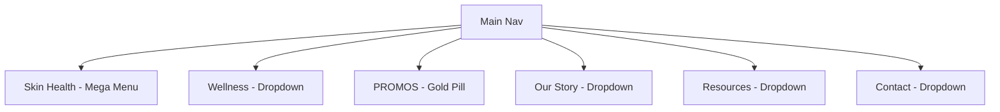
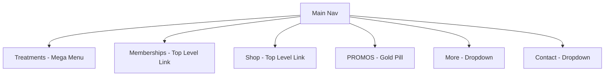

# Navigation Redesign Proposal

This document outlines the proposed layout and structure for rearranging the main navigation menu of the SuA Glow website.

---

## Proposed Navigation Menu Comparison

### Current Navigation Structure


### Proposed Navigation Structure


---

## Detailed Directory Layout of the Proposed Menus

### 1. `Treatments` (Combined Mega Menu)
Instead of two separate menus, we combine **Skin Health** and **Wellness** into a single 4-column Mega Menu layout:

* **Column 1: Skin Health (Boosters & Injectables)**
  * *Skin Quality Boosters*: Healing Essence, Hydration & Glow, Collagen Stimulation, Dermal Matrix
  * *Injectables*: Cosmetic Tox, Medical Tox, HA Fillers, Biostimulators
  * *Scar Treatment*: Acne Scars, Surgical Scars, Stretch Marks, Keloid
* **Column 2: Skin Rejuvenation & Facials**
  * *Skin Rejuvenation*: Oligio X RF Lifting, LDM Water Drop Lifting, Microneedling, Needle-free Infusion, Picosecond Laser, Korean Scalp & Hair
  * *Signature Treatments*: SuA Glow Signature, One Day Glow, Bridal Glow, Seoul Man
  * *K-Beauty Facials*: LDM Water Drop Lifting, Salmon PN Facial, Glow & Hydration, Collagen Stimulation, Tone Up
* **Column 3: Wellness & Metabolism**
  * Medical Weight Loss (Compounded GLP-1 & Korean Body Reset)
  * Body Contouring (Oligio X Body & EmSculpt)
  * Peptides (Targeted Bio-Regenerative Peptides)
  * Women's Hormone Balance (Hormone Optimization & Metabolic Wellness)
  * Pelvic Health
  * Red Light Therapy
  * Advanced Testing
  * Glow Infusion Therapy (IV Infusions & IV Push)
  * Men's Testosterone Optimization
* **Column 4: Featured Spotlight**
  * *Treatment Quiz* (Find your perfect K-Beauty match)
  * Quick links to *Memberships* & *Promotions*

---

### 2. `Memberships` (New Top-Level Link)
* Directly visible on the main nav.
* **Link:** `memberships.html` (or a bookings membership portal).
* *Note: If a memberships.html page doesn't exist yet, we can create a coming-soon or outline page, or link to the booking portal.*

---

### 3. `Shop` (New Top-Level Link)
* Directly visible on the main nav (pulled out from Resources).
* **Link:** `shop-skincare.html` (or `shop-skincare-rejuran.html`).

---

### 4. `More` (New Dropdown combining Our Story & Resources)
Instead of two separate dropdowns, we combine them into a single, clean dropdown:

* **Our Story**
  * Our Story (About Page)
  * What is K-Beauty
  * Safety Protocols
* **Resources**
  * Referral Program
  * Press & Media
  * Financing Options

---

### 5. `Contact` (Dropdown)
* Standard Contact links: Book Appointment, New Patient Forms, Contact Page.

---

## Desktop Navigation Code Mockup (`navbar.js`)

Below is a diff highlighting the changes in the HTML template inside `navbar.js`:

```html
<!-- Desktop Menu -->
<div class="desktop-nav-menu min-[1180px]:flex items-center justify-center flex-1 gap-5 xl:gap-8">

    <!-- 1. Treatments Mega Menu -->
    <div class="nav-item-mega group">
        <a href="skin-health.html" class="nav-link font-body text-[13px] tracking-[0.1em] text-charcoal hover:text-taupe transition-colors uppercase flex items-center gap-1">
            Treatments <i data-lucide="chevron-down" class="w-3 h-3"></i>
        </a>
        <div class="mega-menu p-10">
            <div class="max-w-7xl mx-auto grid grid-cols-4 gap-8 text-left">
                <!-- Col 1: Boosters, Injectables, Scars -->
                <!-- Col 2: Rejuvenation, Signature, K-Beauty Facials -->
                <!-- Col 3: Wellness (Weight Loss, Hormones, etc.) -->
                <!-- Col 4: Quiz & Featured Treatment -->
            </div>
        </div>
    </div>

    <!-- 2. Memberships Link -->
    <div class="nav-item">
        <a href="memberships.html" class="nav-link font-body text-[13px] tracking-[0.1em] text-charcoal hover:text-taupe transition-colors uppercase">
            Memberships
        </a>
    </div>

    <!-- 3. Shop Link -->
    <div class="nav-item">
        <a href="shop-skincare.html" class="nav-link font-body text-[13px] tracking-[0.1em] text-charcoal hover:text-taupe transition-colors uppercase">
            Shop
        </a>
    </div>

    <!-- 4. Promos (Gold Pill CTA) -->
    <div class="nav-item">
        <a href="specials.html" class="group relative inline-flex items-center justify-center gap-1.5 bg-gradient-to-b from-[#FFF2B2] via-[#DFAB22] to-[#B8860B] px-4 py-1.5 rounded-full border-t border-t-white/80 border-b border-b-black/20 hover:brightness-110 transition-all duration-300 shadow-[0_4px_15px_rgba(223,171,34,0.4)] hover:shadow-[0_6px_20px_rgba(223,171,34,0.6)] overflow-hidden uppercase font-heading text-[11px] font-extrabold tracking-[0.15em] text-amber-950 whitespace-nowrap">
            <span class="absolute top-[-10px] right-2 w-12 h-12 bg-white/60 blur-[6px] rounded-full pointer-events-none"></span>
            <i data-lucide="tag" class="w-3.5 h-3.5 text-amber-950 shrink-0 relative z-10"></i>
            <span class="relative z-10">PROMOS</span>
        </a>
    </div>

    <!-- 5. More Dropdown -->
    <div class="nav-item-dropdown">
        <a href="#" class="nav-link font-body text-[13px] tracking-[0.1em] text-charcoal hover:text-taupe transition-colors uppercase flex items-center gap-1">
            More <i data-lucide="chevron-down" class="w-3 h-3"></i>
        </a>
        <div class="dropdown-menu text-left w-56">
            <p class="text-[9px] uppercase tracking-wider text-charcoal/40 px-4 py-1 font-semibold">Our Story</p>
            <a href="about.html" class="dropdown-link font-body text-xs pl-6">About SuA Glow</a>
            <a href="about.html#k-beauty" class="dropdown-link font-body text-xs pl-6">K-Beauty Philosophy</a>
            <a href="about.html#safety" class="dropdown-link font-body text-xs pl-6">Safety Protocols</a>
            <div class="border-t border-charcoal/5 my-2"></div>
            <p class="text-[9px] uppercase tracking-wider text-charcoal/40 px-4 py-1 font-semibold">Resources</p>
            <a href="referral.html" class="dropdown-link font-body text-xs pl-6">Referral Program</a>
            <a href="press-media.html" class="dropdown-link font-body text-xs pl-6">Press & Media</a>
            <a href="financing.html" class="dropdown-link font-body text-xs pl-6">Financing</a>
        </div>
    </div>

    <!-- 6. Contact Dropdown -->
    <!-- (Remains unchanged) -->

</div>
```
